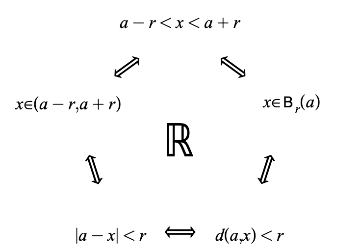

# Open Sets {#sec-open-balls}

## Highlights {.unnumbered}

- Definition of an open ball and open set
- Important equivalent condition to being an open set
- Examples of proving and applying openness

## Preparation

An important tool for describing "closeness" precisely in calculus is the open ball.

:::{.definition #def-open-ball}
Suppose $X$ is a metric space with distance function $d$. Let $a\in X$ and $r>0$. Then the **open ball** centered at^[Sometimes we also say "around $a$".] $a$ of radius $r$ is defined to be
$$\bee_r(a)=\{x\in X\st d(a,x)<r\}.$$
:::

Other textbooks sometimes call $\bee_r(a)$ an "$r$-neighborhood" of $a$.

:::{.exercise #exr-open-balls-sketch}
Describe and draw pictures of open balls in $\R^3$, $\R^2$, and $\R$.
:::

:::{.exercise #exr-open-balls-in-r}
Answer the following questions about open balls in $\R$.

1. Write $\bee_r(c)$ in interval notation.
2. If $a,b\in\R$ with $a<b$, is the interval $(a,b)$ an open ball? If so, what is its center and radius?
3. Is $(0,\infty)$ an open ball? If so, what is its center and radius?
:::

The following exercise is meant to prepare you for the definition of an open set.

:::{.exercise #exr-neighborhood-within-subset-tf}
Say whether each statement below is true or false and give a brief justification.

1. "If $S=(1,\infty)$, for each point $a\in S$ there is an open ball centered at $a$ that lies entirely inside of $S$."
2. "If $S=[1,\infty)$, for each point $a\in S$ there is an open ball centered at $a$ that lies entirely inside of $S$."
:::

## Open Balls

When we apply the definition of an open ball to $\R$, we realize that it's an object we've dealt with before; in particular @thm-open-ball-in-r was really a statement about open balls on the real number line.

Putting @thm-open-ball-in-r together with the language of open balls, we now have many equivalent ways of saying the same thing:

:::{.tfae #fig-open-ball-tfae}
{width=400}

Equivalent formulations for being an open ball in the metric space $\R$.
:::

The equivalent conditions of @fig-open-ball-tfae in $\R$ will show up every day for the rest of the course. The more seamlessly you can translate among these different ways of saying the same thing, the easier the course will be.

> Becoming fluent in @fig-open-ball-tfae is the cheat code for reading analysis proofs.

While using the word "ball" makes intuitive sense in $\R^3$ (and sort of in $\R^2$), it may feel a little weird in $\R$; we'll just need to get used to that. And it gets even stranger when we think about other metric spaces.

:::{.exercise #exr-open-balls-in-trivial-ms}
Let $X$ be a set with the trivial metric (defined in @exr-trivial-metric). Let $a\in X$, and describe the following.

1. $\bee_2(a)$
2. $\bee_1(a)$
3. $\bee_{1/2}(a)$
:::

:::{.exercise #exr-open-balls-in-trivial-ms}
Consider $\R^2$ with the "taxicab metric" $d_1$ defined in @exr-taxicab. Sketch the open ball of radius 2 centered at the origin.
:::

:::{.exercise #exr-open-balls-in-subspace}
Consider $X=\{(x,y)\st y\geq0\}$ as a subspace of $\R^2$. Sketch $\bee_2(0,1)$ in the metric space $S$.
:::

:::{.exercise #exr-hausdorff}
Suppose $X$ is a metric space with distance function $d$. Let $a,b$ be distinct points in $X$. Prove that there exists $\epsilon>0$ such that $\bee_\epsilon(x)$ and $\bee_\epsilon(y)$ are disjoint.
:::

## Open Sets

Now we transition from thinking about open balls to the more general concept of an "open set".

:::{.definition #def-open-set}
Let $X$ be a metric space with distance function $d$. A subset $S\subseteq X$ is called *open* if every point $a\in S$ has an open ball around it that lies entirely within $S$. That is, for all $a\in S$, there exists $r>0$ such that $\bee_r(a)\subseteq S$.
:::

:::{#des-open-set-def .content-visible when-format="html"}

Wherever you move the point $a$ inside $S$, it is possible to draw an open ball around $a$ that stays entirely within $S$ (although the radius will need to change). This means $S$ is open.
:::

Intuitively, an open set $S$ cannot include any of its boundary points because an open ball around a boundary point will contain points outside of $S$.

:::{.exercise #exr-empty-and-whole-ms-open}
Let $X$ be a metric space with distance function $d$. Prove that $X$ and $\varnothing$ are open subsets of $X$.
:::

:::{.proof .content-hidden}
1. $X$ is an open subset of itself. Since $X$ is the whole universe, if $a\in X$, $\bee_1(a)\subseteq X$ automatically.
2. $\varnothing$ is an open subset of $X$. This is true vacuously since the definition of openness applied here start with "for all $a\in\varnothing$".
:::

:::{.exercise #exr-open-balls-are-open}
Prove that open balls are open.
:::

:::{.exercise #exr-complement-of-point-is-open}
Suppose $X$ is a metric space and let $a\in X$. Prove that $\{a\}^\cee$ is open.
:::

:::{.exercise #exr-open-infinite-interval-is-open}
Prove that the interval $(-\infty,3)$ is open in $\R$.
:::

## Review Questions {.unnumbered}

1. What is the definition of an open ball in a metric space?
2. What is the definition of an open set? Can you draw a picture representing this definition?
3. What are the open balls in $\R$?