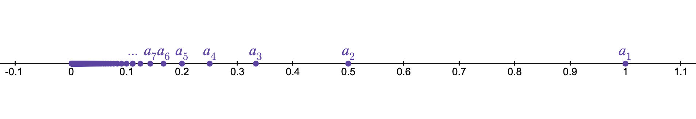
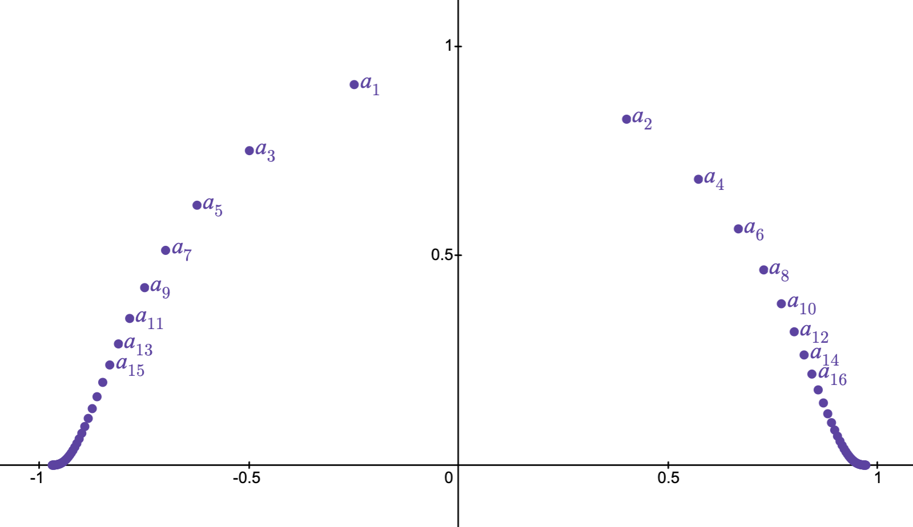
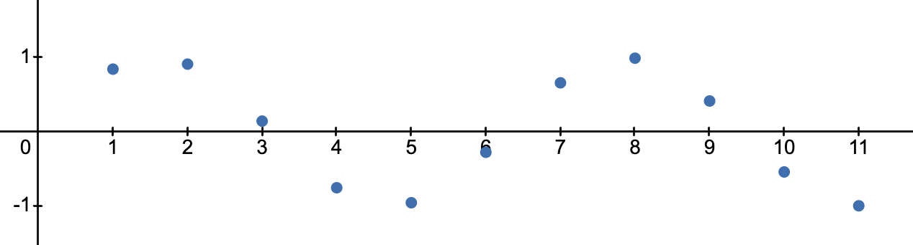
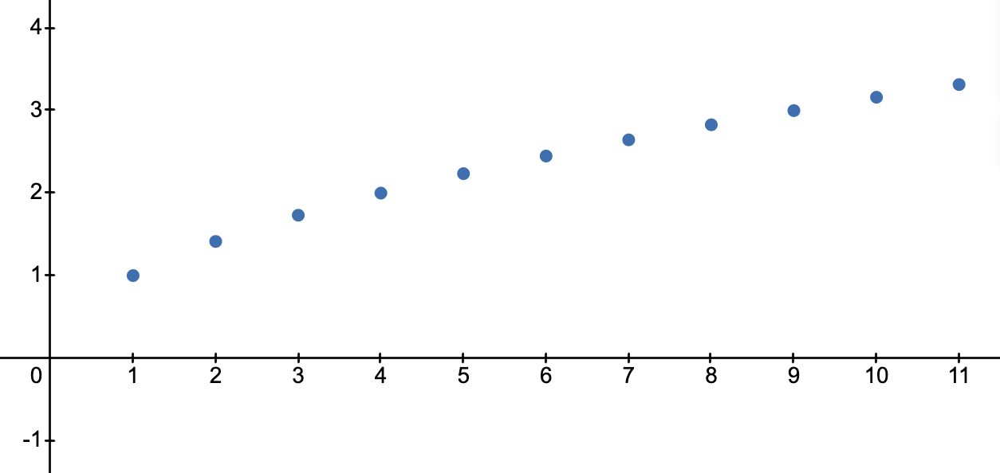
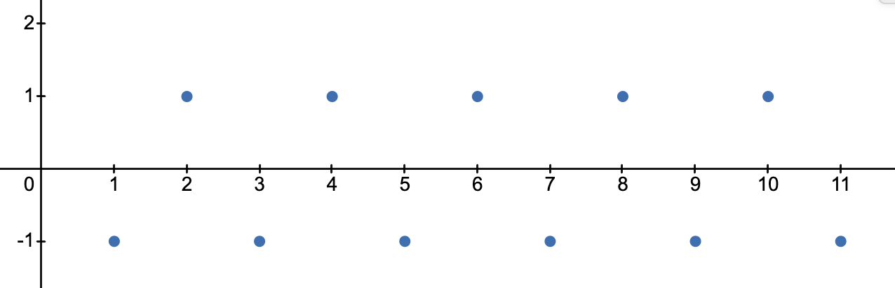

# Talking About Sequences {#sec-sequences}

## Highlights {.unnumbered}

- Definition of a sequence as a function with domain $\N$
- Sequence notation and vocabulary
- Properties that a sequence may or may not have

## Preparation

Sequences are one of the fundamental objects of study in real analysis. They form the theoretical basis for blah blah blah.

:::{.definition #def-sequence}
A **sequence** in $X$ is a function $s:\N\rightarrow X$.
:::

In this context, instead of using standard function notation $s(1),s(2),\ldots,s(n),\ldots$, we instead use subscripts and write $s_1,s_2,\ldots,s_n,\ldots$. We refer to a particular $s_n$ as a **term** of the sequence and to the input/subscript $n$ as its **index** or **position** in the sequence.

:::{.callout-caution}
Under this definition, by "sequence" we always mean "infinite sequence" since the domain is $\N$.
:::

:::{.callout-note}
For now, as we get comfortable with the idea of a sequence, we will insist that our sequences start at $s_1$. Later on, especially when dealing with infinite sums (known as series), we will relax this constraint since it is often convenient to start at $0$ or some other integer.
:::

The **range** of $(a_n)$ is $\{a_n\st n\in\N\}$.

:::{.exercise #exr-finite-range}
Can a sequence have a range that is finite? Explain.
:::

## Sequence Properties

Below are several properties of sequences that we will need moving forward.

:::{.definition #def-sequence-props-any-codomain}
Let $(a_n)$ be a sequence in a metric space. Then $(a_n)$ is said to$\ldots$

1. be **constant** if $a_i=a_j$ for all $i,j\in\N$.
2. have **distinct terms** if $a_i\neq a_j$ whenever $i\neq j$.
3. be **bounded** if its range is.
:::

For sequences in $\R$, we can make some further definitions.

:::{.definition #def-sequence-props-any-codomain}
Let $(a_n)$ be a sequence in $\R$. Then $(a_n)$ is said to be$\ldots$

1. **increasing** if $i\leq j$ implies $a_i\leq a_j$.
2. **decreasing** if $i\leq j$ implies $a_i\geq a_j$.
3. **strictly increasing** (repsectively **strictly decreasing**) if $i< j$ implies $a_i< a_j$ (respectively $a_i>a_j$).
4. **monotonic** if it is either only increasing or only decreasing, and **strictly monotonic** if it is either only strictly increasing or only strictly decreasing.
5. **bounded above** (respectively, **bounded below**) if its range is.
:::

:::{.exercise #exr-sequence-prop-example-generation}
Give an example of a sequence in $\R$ with the properties below, or prove that no such example exists.

1. A sequence which is both increasing and decreasing.
3. A sequence which is strictly increasing and bounded above.
4. A bounded sequence of distinct terms.
6. A sequence of distinct terms that is increasing but not strictly increasing.
5. An unbounded sequence which is not monotonic.
7. A sequence with a finite range that is unbounded.
:::

:::{.theorem #thm-amazingly-useful}

#### The Amazingly Useful Theorem

Suppose $(i_n)$ is a strictly increasing sequence in $\N$. Then $i_n\geq n$.
:::

:::{.exercise #exr-amazingly-useful-proof}
Prove @thm-amazingly-useful by induction.
:::

:::{.proof .content-hidden}
We will do a proof by induction.

For $n=1$, $i_n\in\N$ so $i_1\geq1$.

Suppose $i_k\geq k$. Then since the sequence is strictly increasing, $i_{k+1}>i_k\geq k$. Since $i_{k+1}$ is a natural number strictly greater than $k$, $i_{k+1}\geq k+1$.
:::

## Visualizing Sequences

We often visualize a sequence $(a_n)$ by showing either its *range* in the codomain or, for sequences in $\R$, its *graph* in the cartesian plane.

:::{#fig-sequence-ranges layout-ncol=1}

{#fig-recip-seq-range}

{#fig-seq-range-r2}

Here we show the ranges of two sequences. When plotting the range of a sequence, we usually number at least the first several terms.
:::

When plotting the graph of a sequence, we use the horizontal axis for the indices (in $\N$) and the vertical axis for the terms (in $\R$).

:::{#fig-sequence-graph layout-ncol=1}

{#fig-sin-n-graph}

{#fig-sqrt-n-graph}

{#fig-alternating-graph}

The graphs of three sequences in $\R$.
:::

:::{.callout-tip collapse="true"}

#### Hint

A collapsed hint.
:::

## Review Questions {.unnumbered}

1. Question 1
2. Question 2

## To include

- Quick teaser about convergence
- Lots of examples of sequences
- Constructing sequences by induction?